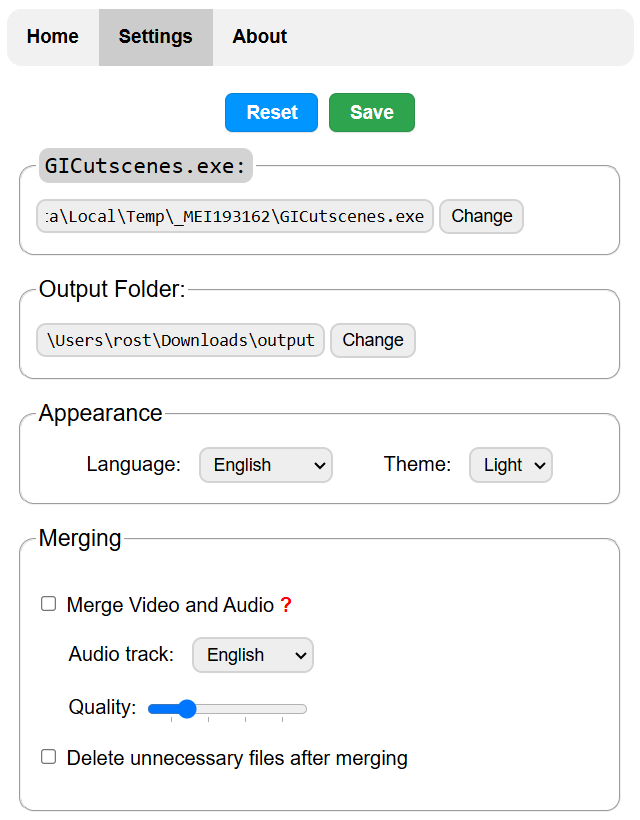
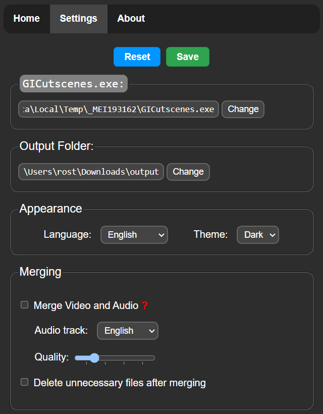

<h1 align="center">GI-Cutscenes UI</h1>

<p align="center">
    
</p>
<p align="center">
    <strong> User Interface for <a href="https://github.com/ToaHartor/GI-cutscenes">Genshin Cutscenes Demuxer</a></strong>
</p>
<p align="center">
    </br>
    <a href="#donate"></a>
</p>

## Screenshots:
<details>
  <summary></summary>
  
  
  
  
</details>

## Usage:
1. Download archive from [Releases](https://github.com/SuperZombi/GICutscenesUI/releases/latest)
2. Unzip it to a convenient location.
3. Start ```GICutscenesUI.exe```

## FAQ

### Where are the game files with cutscenes?
`[Game directory]\Genshin Impact game\GenshinImpact_Data\StreamingAssets\VideoAssets\StandaloneWindows64`

### I have an error when demuxing files
Try to update your [GI-cutscenes script](https://github.com/ToaHartor/GI-cutscenes/releases) to the latest version.<br>
Specify the path to the `GI-cutscenes.exe` in the settings.

### I have an error in merging video
Try to update your [ffmpeg](https://github.com/BtbN/FFmpeg-Builds/releases) to the latest version.<br>
Add the `ffmpeg.exe` file next to the exe file you are running.

<br>

### Help with <a href="translations.md">translation</a>

<hr>

#### 💲Donate
<table>
  <tr>
    <td>
       
    </td>
    <td>
      <a href="https://donatello.to/super_zombi">Donatello</a>
    </td>
  </tr>
  <tr>
    <td>
       
    </td>
    <td>
      <a href="https://www.donationalerts.com/r/super_zombi">Donation Alerts</a>
    </td>
  </tr>
</table>
