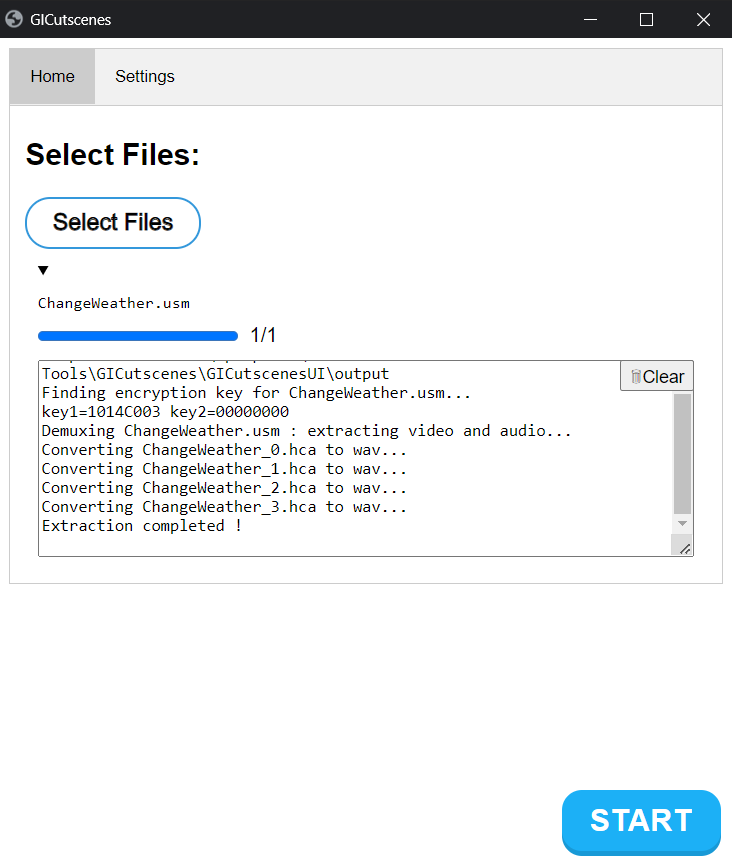
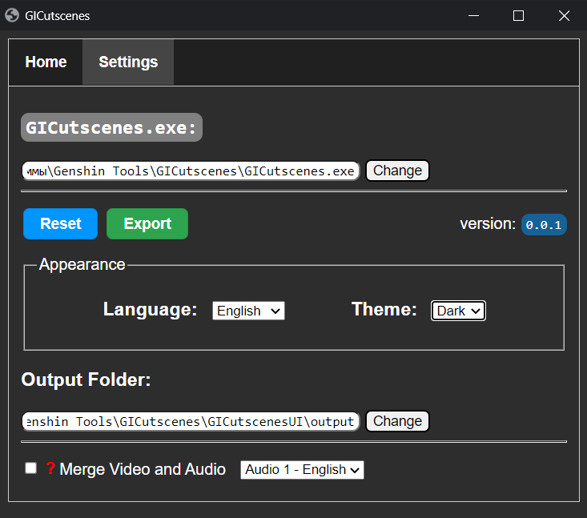

<h1 align="center">GI-Cutscenes UI</h1>

<p align="center">
    
</p>
<p align="center">
    <strong> User Interface for <a href="https://github.com/ToaHartor/GI-cutscenes">Genshin Cutscenes Demuxer</a></strong>
</p>
<p align="center">
    </br>
    <a href="#donate"></a>
</p>

## Screenshots:
<details>
  <summary></summary>
  
  
  
</details>

## Usage:
1. ~Download [FFMPEG](https://github.com/BtbN/FFmpeg-Builds/releases)~
2. ~Download [GI-cutscenes](https://github.com/ToaHartor/GI-cutscenes/releases)~
3. Download GUI from [Releases](https://github.com/SuperZombi/GICutscenesUI/releases)
4. Start ```GICutscenesUI.exe```
   
## FAQ

### How to install FFMPEG?
Download ffmpeg (I recommend downloading the `gpl` version). Unpack the contents of the `bin` folder into the program folder.

### Where are the game files with cutscenes?
`[Game directory]\Genshin Impact game\GenshinImpact_Data\StreamingAssets\VideoAssets\StandaloneWindows64`

### I have an error in merging video
Try to update your ffmpeg to the latest version. Most likely you are using an old version (which is installed by default), which does not support the VP9 codec.

### I have an error in merging video
Try to update your ffmpeg to the latest version. Most likely you are using an old version (which is installed by default), which does not support the VP9 codec.

### How to Increase FFMPEG version?
If you want to use a newer version of ffmpeg, add the `ffmpeg.exe` file next to the exe file you are running.

<br>

### Help with <a href="translations.md">translation</a>

<hr>

#### 💲Donate
<table>
  <tr>
    <td>
       
    </td>
    <td>
      <a href="https://donatello.to/super_zombi">Donatello</a>
    </td>
  </tr>
  <tr>
    <td>
       
    </td>
    <td>
      <a href="https://www.donationalerts.com/r/super_zombi">Donation Alerts</a>
    </td>
  </tr>
</table>

(But now it's better to email me and I'll send you the details)
